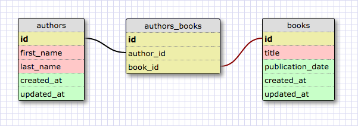

# Schema Design: Many-to-many Schema 
 
## Summary 
In [another challenge][one-to-many challenge], we looked at the one-to-many relationship between two database tables.  In this challenge we're going to look at another relationship:  many-to-many.

Here are some situations for when a many-to-many relationship would be appropriate.  A magazine has many subscribers, and a subscriber can subscribe to many magazines.  A customer reviews many products, and a product has many reviewers.  An author can write many books, and a book can be have many authors.

Conceptually, many-to-many relationships are relatively easy to understand, but they can be slightly more complicated to implement.  In order to model a many-to-many relationship, we need to introduce a third table, a *join table*.

  
*Figure 1*.  Modeling a many-to-many relationship between authors and books.

In Figure 1 we model the one of the examples given earlier, using the *authors_books* table as a join table between the authors and books tables.  Look at the join table.  What data does it hold?

The join table contains two foreign key fields:  one that points to an author and one that points to a book.  For a given author whose id we know, how would we use the join table to find which books the author had written?

*Note:*  A join table can have more fields than just the two foreign key fields.  For example, a join table linking magazines to subscribers could hold information like the date the subscription began, the length of the subscription, etc.  In such cases, we would also add *created_at* and *updated_at* fields.

## Releases
### Release 0: Design a Schema to Support Product Reviews
Using the [schema designer], model a database schema that will support the following functionality.  Assume that our application has (1) users with e-mail addresses and usernames and (2) products with names and descriptions.

- Users can review products, giving a score from 1 to 4 and writing a description.
- Reviews can be favorited by users.

When our schema is complete, take a screenshot of the design and commit it.

## Conclusion
Like the one-to-many relationship, the many-to-many relationship is fundamental to designing a database schema.  We need to recognize when such a relationship is appropriate and then know how to implement the relationship using a join table.

[one-to-many challenge]: ../../../database-drill-one-to-many-schema-challenge
[schema designer]: https://schemadesigner.devbootcamp.com/

